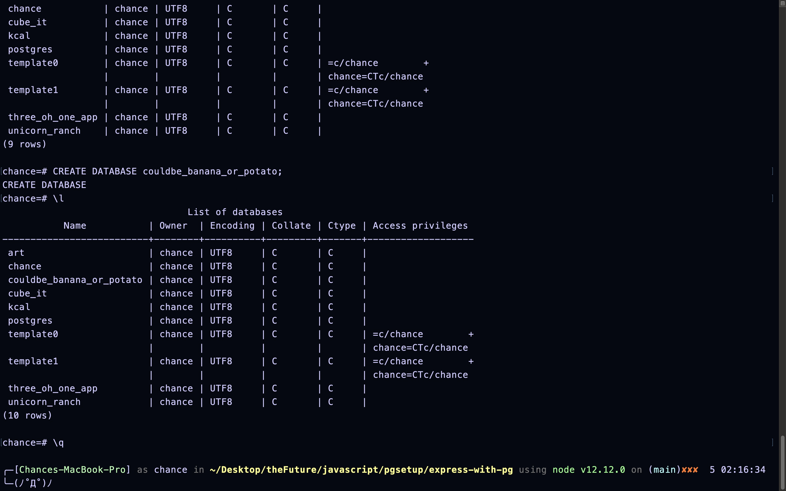

# express-with-pg
Basic express server with pg and psql added

# Mission Goal
  - Establish a minimum node.js server before implementing anything related to database interactions or database connections.
  - Once that is documented, walk the steps from scratch of incorporating the npm library of `pg` as well as connectiong to our `postgres` database.

# Basic Server Needed
  - Below will be a series of of screen shots and explanation to be able to confirm a server is up and running before we connect and interact with the database.

  # From Scratch

    # In Terminal
    - Navigate to the current repository that you would like to apply these skills to.

    - Ideally you would like to see something like below, but fill in the possible variable name differences as needed.

   

   - If I know I am writing a server, I would first touch a `server.js` file at the root of my project.
  
  - Next step would be to run the command `npm init -y`.

    - Keep in mind the -y is optional. It selects the default values for the `package.json` file that the script is about to build you. Running `npm init -y` should be more than suffcient for your time in 301.

    - At this point, this is what I expect your ouput to be in your terminal.

   

  # Open Your Code Editor

    - Your tree to left should look something like this now.

   

   - Note
     You should not have `README.md` or an `assets` directory. That is specific to this repository and examples presented. 

  # Still in Your Editor

    - This is a shot of the basic code, before any incorporation of postgres of SQL, of a `node.js` express server.

   

    - To try to establish 'proof of life', we need try turning this on in our Terminal. 
      - Current Methods/Commands we can run in our Terminal

        - `node server.js` In the repository you have working to prove this code so far.

        -  `nodemon` In the repository you have working to prove this code so far, pending that you have nodemon installed.

          - If unsure about `nodemon` being installed, you can copy paste this into your terminal, no matter where you are at as far as directory level in the terminal. 
            - `npm install -g nodemon`

          If you have issues with this reach out to someone.

  # Expected Output

    - So far this is what i would expect to see in your Terminal.

    

    - The part I want to highlight on purpose is `Cannot find module module-name-goes-here`

  - The purpose of this was to illustrate 98% of common errors at this point.

    - So far, the most common case for this error is:

      You are requiring an npm library in your code, but you have not yet done the npm install of that library in your terminal yet.

      - Fix: In your terminal run this command `npm install <library name of the module not found>`

  # To Save Time

    - To avoid the rest of these errors, you can run `npm install express cors dotenv`.

      - You can install multiple npm libraries as long as they are seperated by a white space.

  # Post Terminal Screen Shots

     

   - If you do not have the same console output in your terminal, please reach out. There could be a lot of reasons why you may not have a successful output. I designed this demo around a lot of assumed conditions, I would be more than happy to add edge case conditions in a future version of this repository. Please report them!

  # At This Point

    - We are moving on from basic server setup via `node.js` using express.

    - The only assumption past what was demonstrated so far is that you have postgresql and node installed on your machine. If not, that will be a future link to handle these issues. I just am not going that deep on initial build of this document and errors that could occur outside of this scope.

  # Next Steps

    # Step 1:

      - I am going to start in the Terminal. 
        - From Here: 
          - Type psql in the root of the project you are working on in Terminal.
            - If errors, I plan to add how to handle this in time.
          
          - At this point you should be seeing something similar, pending the variable names of the databases and some of the default databases postgres comes with.

    

    - **Note**

      - We have not yet created a database to handle the app yet.

    - Next step:
      - Create a database that you want to use for your project.
      - Something like `CREATE DATABASE new_project_db`  
        - Upper case are common practice for SQL Commands, labels or selectors are lower case by best practices.

    # Post CREATE DATABASE command

   

    - If you don't have the same feedback of CREATE DATABASE, make sure you have finished the command with a `;`. The psql shell is picky about everything.

    - We are done with the psql shell at this point. To exit out, \q is the shorthand to quit. I think you can also type exit and will also get you out of the psql shell.

    

    # Step 2:

      - We have created a database, now we need to address the fact that we need to install a lib called pg, that let's us talk to our postgres database. 

        - Install the library of pg, `npm install pg`
        - Declare and require pg into your code base.

   

    - If this code is successful, and you try to turn on your server in whatever way is your flavor, you should see an output as such.

    

# Current Outcome

 - Pending no errors to this point, you should have all of the pipelines and tools setup to go have fun implementing database features into your sweet new express `node.js` server. More error cases will be added in future versions of this. Just wanted to get the basics down on paper for others. 

